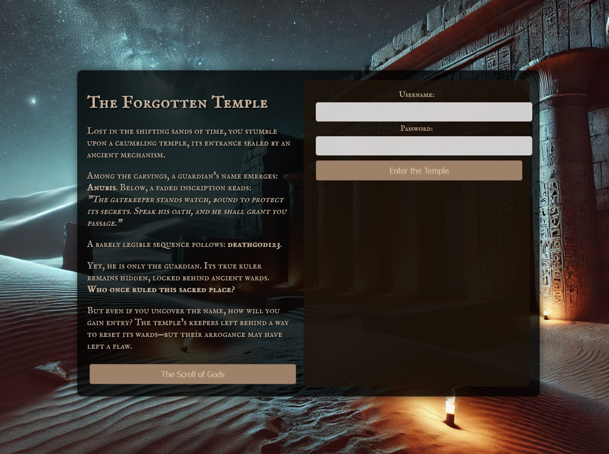

&nbsp;

# 1 Writeup – *Forgotten Temple*

<table style="width: 100%;"><thead><tr><th style="width: 54.79%;">
<table><thead><tr><th>Challenge Name:</th><th>Category</th><th>Difficulty &amp; stats</th></tr></thead><tbody><tr><td>Forgotten Temple</td><td>Web</td><td>100 points, no help, first challenge attempted</td></tr></tbody></table>
</th><th style="width: 45.21%;"></th></tr><tr><th style="width: 54.79%;">Challange description:</th><th style="width: 45.21%;">Challange lore/hints:</th></tr></thead><tbody><tr><td style="width: 54.79%;"><em>Automated enumeration and brute-force tools are allowed in this challenge, though limited to provided list.</em>  A website with basic login functionality and some fluff with hints. Username list downloadable via link. No flashy frontend behavior, no notable JavaScript magic.</td><td style="width: 45.21%;">The temple stands locked behind divine wards, its secrets protected by ancient code and loyal guardians. [...] Among the carvings, a guardian's name emerges: <strong>Anubis</strong>. A barely legible sequence follows: <strong>deathgod123</strong>.  Yet, he is only the guardian. Its true ruler remains hidden, locked behind ancient wards. <strong>Who once ruled this sacred place?</strong> The temple’s keepers left behind a way to reset its wards</td></tr></tbody></table>

* * *

## Reconnaissance:

Initial attempts used basic username/password combos like `admin / password`, `guest / changeme`, etc. No success.

Upon inspecting the HTML source, found a comment referencing a password reset feature—clearly intended for “Anubis.” A separate line was a button linked to a text document. Downloaded that and made a note to not ignore giant obviously useful buttons on the landing page. \[Obstacle 1, see *Missteps*\]

**Plan:**

1.  Log in as Anubis
    
2.  Analyze behavior
    
3.  Attempt to reset an admin-level user
    

Login with Anubis and the "secret oath" confirmed working and leads to a password reset page   
Password reset request provide username and new password to the server in clear text. Easy indication of abuse (or a no fun honeypot) \[obstacle 2\]

* * *

## Exploitation:

**Step 1 – Learn the reset flow**  
While logged in as Anubis, reset his password again to test the functionality. Observed that a simple POST with  
`username=userWithNewPW  newpassword=password` was sufficient. Confirmed no token or email validation.

**Step 2 – Use Burp Intruder**  
Set up Burp Intruder to iterate through the downloaded username list against the password reset POST request. Only two valid users responded: Anubis (known) and Khonsu.

**Step 3 – Reset Khonsu’s password**  
Successfully reset and logged in as Khonsu. Flag was immediately visible upon login.

* * *

##   
Missteps:

**Obstacle 1 – Lack of  planning**  
The first half of this challange and 3/4 of time spent time can be summarized approximately: f\*ck around and figure it out. Started clicking on all the things with no real strategy, just exploratory learning. While not efficient challange progress, this did help make the interface and terminology more familiar. But made emotional progress (“confusing but now a *familiar* confusing”). 

**Obstacle 2 - No familiarity with Burp Suite**

Realized I did not have any actual idea how to proceed. This required going back and re-research the tools, watching tutorials on burpsuite and skimming some guides. Time intensive but valuable, used burpsuite to analyze network traffic and learn the reset flow. Later had to do this again to learn what intruder was and worked because I was **not** going to sit and manually test 100 usernames  
**Obstacle 2.5 -** Scary using offensive tools against an environment not mine, this made me hesitant to just send a brute force attack

**General Obstacle – Temptation to overtool**  
Considered trying directory enumeration or subdomain fuzzing but held back. Was aware these might not be relevant and didn’t want to risk overwhelming the server infrastructure. Learned some restraint, remain tempted.

* * *

## How the owner should fix:

- Require a valid password reset token tied to the account and issued via secure means (e.g., email verification or CAPTCHA challenge).
    
- Prevent unauthenticated users from resetting arbitrary passwords.
    
- Sanitize and validate reset input on both client and server.
    
- Log and rate-limit reset requests to detect abuse.
    
- Consider reducing in-browser hints (e.g., not referencing usernames or password resets in comments).
    

* * *

## ✅ Flag:

Captured

* * *

## Conclusion:

**First challenge attempted – and solved!**  
The path to victory was slow, winding, and full of self-doubt, but progress came in layers:

- **Big blocker:** Learning how Burp worked. Felt like a toddler with a chainsaw.
    
- **Critical realization:** Anubis was *not* the key, Khonsu was.
    
- **Most valuable lesson:** It’s fine to flail—if you flail persistently. Also, use Intruder.
    

This challenge seeded confidence for the rest of the CTF. From "clicking all the things" to understanding request payloads—progress is progress.

* * *

Challenge made by: Cathleene Sandgren
