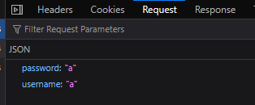
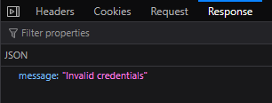

## **Tomb Raiders**

  
Nothing seem familiar and everything seem complicated... Try to play the videogame and trying to find cheats, there is no success. Cost/benefit analysis of trying to find some actual useful information from the internet or LLM that both apply for this case and is on a level I can easily learn during an evening and also have time doing more challanges.  
Proceed to other challanges  
 Same opening moves as the other two. This one more familiar than Tomb Raiders, not as clear as Temple. I look through what I can easily access, as I don't find anything I start researching what path traversal is. Realize this is a familiar idea. The time is now late, I forgot to eat dinner and need sleep. If I want to give it a try and learn how to do path traversal exploits, that will be done in the morning or later.  
Promptly forget about the challange when going to slepp. Yet again, another lesson to do actual documentation and not forget fun sounding challanges until a day after the close of CTF and doing a post mortem about it all.

* * *

## **Tomb of the God of Mischief**

  
I spent many hours on this with the only conclusion and worthwhile takeaways being along the lines of:

- Don't use GPT. Really really.
- For real tho. DON'T
- If you don't understand the problem or what is happening. Stop, either:
- Abandon
- Get guidance
- Research the underlaying concept

The VM being used was assumed cursed by the god of mischief and was eventually and emphatically nuked. All documentation and screenshots went down with the ship

# 7 Writeup – The Pharaoh’s Dashboard

| Challenge Name: | Category | Difficulty & stats |
| --- | --- | --- |
| Dashboard | Auth | 244 points and 9 solves at finish |

| Challenge description: | Challenge lore/hints: |
| --- | --- |
| A locked-down admin login page with no visible registration or credential hints. All login attempts return `401 Unauthorized`. Redirection hints at middleware-based access control. | \- no bruteforcing |

## Process:

Initial inspection showed `/admin` redirects to `/admin/login?from=/admin`, confirming route guarding via middleware. Submitting junk credentials returns `401 Unauthorized`.  

However, submitting malformed JSON (e.g., just `"`) returned a `405 Method Not Allowed` and an `"Internal server error"`. This hinted at fragile backend input handling — likely in Express or Next.js API routes.

Tried multiple bypass strategies:

- No SQL payloads (e.g., `{"username":{"$ne":null}}`) — blocked
    
- Path traversal (`/admin/.`, `%2e`, `..%2f`) — redirected
    
- Header manipulation (e.g., `Authorization`, `Cookie`) — ineffective
    

### The consistent 405 on malformed input suggested a parsing flaw or unprotected middleware path might exist, but no full bypass was found   
 \[ABORTED\]

* * *

## Missteps & Dead Ends:

- Spent way too long on injection and path traversal instead of focusing on the backend’s fragile error handling.
    
- Ignored the significance of the 405 error until later.
    
- Tried to advance and find solutions by feeding GPT data and my own thoughts. This backfired massively
    

* * *

## Conclusion:

A well-crafted challenge that nudges the player away from brute-force and toward logic flaws. The brittle response to malformed input is key.   
 Reflection: after seeing others writeups this seem exceedingly simple and I could potentially have solved this if I did not stress and try to make the AI do heavy lifting for me. Researching exploits is completely foreign to me and is a required skill for future CTFs

&nbsp;
