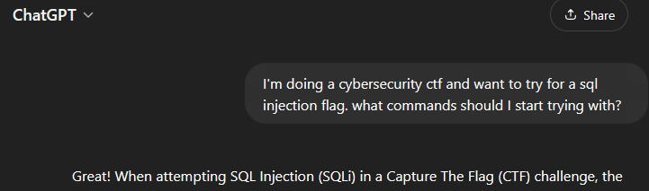

A writeup of this challenge was difficult and will not follow the other format. It will be abridged and general

Having heard what SQLi was this was the first I decided to try it out, speed and progress was prioritized  
<br/>Starting out I had a decent plan. Do stuff and see what happens.  
<br/>

Which was a decent start and got me part of the way to learning  
Unfortunately it was followed by 5+ hours of not understanding what I was doing and blindly testing AI hallucinations and getting stuck on things like:

```
//Request
search_term=1' UNION SELECT 1, column_name, null FROM information_schema.columns WHERE table_name='sacred_texts'--

//Response
<p>Error executing query: each UNION query must have the same number of columns
LINE 1: ...isitors WHERE visitor_name LIKE &#39;%1&#39; UNION SELECT 1, column_...
                                                             ^
</p>
```

And being unable to proceed without AI. I would prefer not to remember this one. But there was to many lessons learnt about process, research and tool-selection (not to mention the GPT chat-history) to simply ignore. Even reading back now it shows I was unhappy with my decision as I did not fully read responses and glossed over things like GPT recommending to use SQLMap and asking the AI to craft payloads instead of like... Explain **how** to craft a payload.  
<br/>Conclusion  
This got me far and set the base for me to actually understand what I was doing in *8 - Legacy of the Scholars* in this challenge the only worthwhile takeaway is the foundation I put down for the future. The actual challange and the progress I made to this flag: technically happened. Also thought me what not to do, and in a roundabout and slowly thought me SQLi and to not fear hacking  
<br/>
