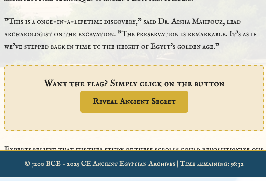
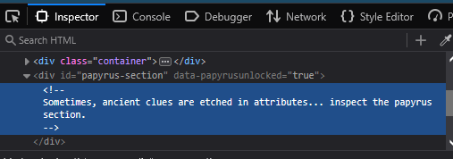
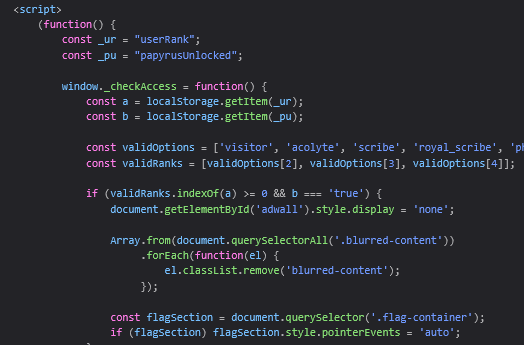
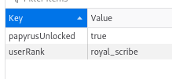

## 6 Writeup – Ancient Archives of Egypt

* * *

| Challenge Name: | Category | Difficulty & stats |
| --- | --- | --- |
| The Ancient Archives of Egypt | Authentication | 100 point and 26 solves at finish |

| Challange description: | Challange lore/hints: |
| --- | --- |
| Hillarious.    Find a way to circumvent a paywall to the Pharaohs most click-baity site. A membership popup blocks the majority of your view, first part is to circumvent this. A surprise second part is gaining the correct credentials to actually reveal the flag. | So you want the flag but don't know where to get it, no problems. It's simple really, see why 10 CTF players hate this one trick, simply click on the button below and get your flag. This exclusive knowledge is usually reserved for those with special access...  To pass the adwall, two ancient tokens must be inscribed in the local chamber of wisdom:  one reveals your status among scribes, the other confirms the scroll is unsealed.  click on the button below and get your flag. This exclusive knowledge is usually reserved for those with special access...  To continue reading this sacred papyrus and access the ancient secrets, you must provide an offering to the gods.  Sometimes, ancient clues are etched in attributes... inspect the papyrus section. |

## Record

Start with inspecting html, the actual content/article is still present on the webpage there is simply another div layered on top. The content is available in html and scripts. Simply deleting the nodes allows for access to the site in rendered view. The next step is revealed. We simply have to click a button to get the flag. This button is visible and not interactable in the rendered view.

Going back to inspection there is a (seemingly) empty &lt;div&gt;   
  
Viewing it in Debugg tab shows us 

tldr. it checks if two constants with the correct value is in local storage  
Depending on values of these the page give or deny you access  
  
After clicking button you get the flag string

* * *

## Missteps, Dead Ends & Conclusion:

This was the perfect level for me and my skillset. There was plenty of red herrings and dead ends, but I never really got stuck in a rabbit hole.   
The papyrus section has a value that seem inert, so easily you try to find exactly what the value does. The pop-up/blurring is technically also a dead end since you don't have to do anything but click the button in rendered view.   
I did get stuck on   

as I initially tried to find an exploit with the flag-result div. In hindsight this might seem like a strange mistake, but with my inexperience of js and other types of dynamic scripts my brain latched on to the most understandable/familiar.  
The one major stumbling block was adding things to storage. I could figure out the logic of what and how the page checked for access, I simply did not understand HOW the interact with this. A good section of time was spent on fuffing about with cookies and confusion and reading irrelevant documentation. The confusion ended when I paid attention to the localstorage.getItem(); and the logic leap to add entries in "Local Storage" was not strenuos.

* * *

## Flag:

Collected

* * *

&nbsp;

&nbsp;

# 7 Writeup – The Canoptic Jars of Osiris

| Challenge Name: | Category | Difficulty & stats |
| --- | --- | --- |
| The Canoptic Jars of Osiris | Extra / Obfuscation | 200points and 19 solves at finish |

| Challange description: | Challange lore/hints: |
| --- | --- |
| A basic form with input field and submit button, also button for hint.    Seemingly the goal is to find the proper input of base64 to submit for the flag to be released    One is probably supposed to pass the string 'ancient_secret' in the correct format/with some modifiers/conditions, this should be done in JSON format and encoded in base 64. The hint about the token gives us a pretty good direction to start in. | To unlock them, you had to decipher cryptic clues left by the gods themselves.   Your first challenge: "Only those who understand the whispers of the past may claim the treasures of the gods..." With every riddle solved and trap avoided, you drew closer to the jar. But to unlock it, you needed the right token.    "The jar awaits a sacred offering, a payload crafted in the ancient form of JSON. The key must be 'token', and the value holds the ancient secret passed down through generations. Encode your offering in base64 to unlock the wisdom of Osiris. Only the one who knows the 'ancient_secret' will reveal the power within."    Keywords: JSON, key is 'token', value holds secret, Encode in base64, **'ancient_secret'** |

## Proccess:

Nothing noteworthy in html and using firefox debugger there is three javascript files that seem to be non-infrastructure, these are all written on one line giving absolutely atrocious readability. Make note of these and set aside.

Fresh from doing SQLi my mind is still on that track and I see a input field and submit button, there is a know way to proceed.  
And I have used cyberchef previously so it was very easy to simply feed in attempts and have them converted to base64

Using burp repeater `Error processing the offering: Expecting value: line 1 column 1 (char 0)`

Then proceeded to map out different SQL injections, unsurprisingly no vulnerabilities were discovered. Further research were conducted by pasting in a bunch of code into GPT and asking the age-old question of "wtf??"  
After recieving a few suggestions of how to do JSON commands, I conducted a short period of grumpy testing of "Ancient_secret", "token", "key" etc. Followed shortly by a grumpier period of testing "ancient_secret" without capitalization.

It did not take long to arrive at: {"token": "ancient_secret"} and the flag was awarded.

**Step-by-step:**  
extract hint from webpage -> combine keywords in json format -> turn into base64 -> arrive at the token being ancient_secret

* * *

## Missteps & Dead Ends:

The obvious one is that I did not research the error code I recieved. Like, at all. This is poor and disappointing. The other big one was grabbing the hint immediately, this made me instantly decide on a solution without proper planning and consideration. This is the one time using a LLM actually stopped me and made me think for myself.  
This was followed by sloppy mistakes like spelling incoregtly and switching the order of the JSON command. This was the easiest challange I completed. And the one completed I am most dissatisfied with, because: had I been more doing proper team management and making sure the members were taking care of themselves this could have been avoided trivially. So I John the team captain must apologize to my team-member: John (also me).

* * *

## Conclusion:

Mechanically simple challenge with a straightforward and satisfying design, when using the hint.
