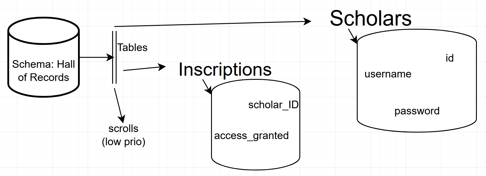
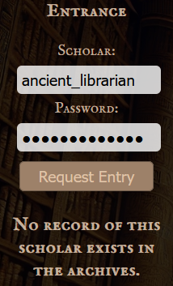

# 8 Writeup – \*The Legacy of the Scholars\* (SQL Injection Challenge)

| Challenge Name: | Category | Difficulty & stats |
| --- | --- | --- |
| The Legacy of the Scholars (TLoS) | SQL Injection | Medium 244point and 9 solves at finish |

| Challange description: | Challange *LORE/HINTS*: |
| --- | --- |
| A webpage with three clear sections titled "Entrance" containing login form, "TLoS" with 2nd paragraph in *LORE* & a search field + button, "Grand Archive" a list of fictional literary titles.   Inspecting HTML show no unexpected invisible content and both search & login is done in POST forms. Javascript contains many functions \[Obstacle 1, see section: *missteps*\]    The goal seem to be to login in to the archive and be able to access the scrolls, leaving hints that *inscribing name* is required as well as another level of knowledge. It is under SQL injection and seem to be medium difficulty, meta knowledge therefor hints that there isn't many/any exploits outside SQL here so investigation priority is set there. | Within the Grand Archive, thousands of scrolls whisper secrets of a forgotten age. Only those who***inscribe their names*** into the sacred records may request ***access*** to the hidden knowledge.   Yet the ancients, for all their wisdom, left behind subtle cracks in their defenses. Can you uncover the path to enlightenment... or will your name fade among the unworthy?    The vast halls of the Grand Archive stretch beyond sight, lined with ancient scrolls containing thousands of years of wisdom.   Among the shelves, you find a forgotten ledger:   "Only those who inscribe their name into the records of history may seek true enlightenment. But names alone are not enough. The trials of the ancients must be understood and overcome.". |

* * *

## Reconnaissance:

Test available inputs through burp by running through different types of payloads, harmless guesses á la "admin + password" & "user + 123" to see response structure. Then include special characters and \`' OR '1'='1\` etc. Login form did not seem responsive to basic exploits but the search function accepted input without sanitization. Continue by mapping out the database with different *UNION SELECT* against *information_schema* \[Obstacle 2\]

### Discovered schema:

 Within the columns both ID versions was integers iterating from 1 and onwards, access_granted held a list of two characters assumed to represent bools, username & password both seem to be what it says on the box

* * *

## Exploitation:

<table border="1" style="border-collapse: collapse; width: 100%;" class="jop-noMdConv"><thead class="jop-noMdConv"><tr class="jop-noMdConv"><th scope="col" style="width: 48.4521%;" class="jop-noMdConv"><h3 id="step-1-extract-credentials" class="jop-noMdConv">Step 1 - extract credentials</h3>
Using UNION SELECT get username &amp; password from scholars

Found: Many entries
<ul class="jop-noMdConv"><li class="jop-noMdConv">
<code class="inline-code jop-noMdConv" spellcheck="false">id: 1</code>
</li><li class="jop-noMdConv">
<code class="inline-code jop-noMdConv" spellcheck="false">username: ancient_librarian</code>
</li><li class="jop-noMdConv">
<code class="inline-code jop-noMdConv" spellcheck="false">password: ancientwisdom</code>
</li></ul>
This'll do
<h3 id="step-2-confirm-credentials" class="jop-noMdConv"><strong class="jop-noMdConv">Step 2</strong> – confirm credentials</h3>
Match id 1 to inscriptions and confirm it has access_granted
<h3 id="step-3-login" class="jop-noMdConv"><strong class="jop-noMdConv">Step 3</strong> – login</h3>
Simple, just input the credentials. Request access. Grab flag, then party.

Leading to: Nothing, repeating exploitation with same user and users with assumed "false" in access_granted gave same result
</th><th scope="col" style="width: 48.4521%;" class="jop-noMdConv">

[Obstacle 3]
</th></tr></thead><tbody class="jop-noMdConv"></tbody></table>

* * *

## Missteps:

Obstacle 1: Initial progress was hindered by attempting to parse javascript without prerequisite knowledge, which ended with relying on LLM for analysis. This time was poorly and uselessly wasted, not because there was no learning and not because it failed to give results. It was wasted because I had attempted to parse scripts previously, hints, previous challenges and meta knowledge indicated the script was non-vital.   
Remediation: Learn JavaScript in advance of next CTF, when participating DO ignore things you do not understand ***until*** progress in proficient areas stall  
 Obstacle 2: Similarly to 1 there was not the prerequisite knowledge for this step. Unlike 1 this was a extremely valuable time sink, even when there was no final victory. During this challenge (as opposed to previous aborted challenges) the UNION commands started to make more sense and actual knowledge of how SQLi started to mesh with the long ago and half forgotten info I had learnt.  
 Obstacle 3: My knowledge and understanding of SQLi did not extend beyond the reconnaissance stage. I was able to learn much of what is stored on the database and the next step to inject a new entry seemed both perfectly logical and completely possible. Unfortunately I did not know how.

* * *

## Solution:

Unknown. Suspected and then posthumously confirmed to be to add a personal user into the database and use this to login.

## Remediations:

Make the search sanitize inputs, this is simple and quick and remove a huge attack surface. Additionally, don't store login credentials where the search function can access them (even inadvertently). This would reduce the risk of a similar attack being successful. Passwords can be stored as salted hashes, this would do much both to reduce the likelihood of a successful attack **and** mitigate the potential damage in the event of a breach or leak. This could save much goodwill from customers/users and retain reputation of management. As well as avoiding potential legal issues with GDPR and NIST2, which this important and magnificent infrastructure object of the Pharaoh could classify as. This is indeed a research institution that could fall under NIST2 directives and can impose fines up to 7mil€ or 1,4% global annual revenue.

* * *

## Flag:

DNF

* * *

## Conclusion:

8th challange attempted  
I got VERY VERY close. Time was running out and prioritized submitting the survey over getting legitimate challenge completions, especially since I suspected the solution was a completely foreign technique.

- Stumbling block: First time doing SQLi, leading to abundance of learning and progress was very jerky (like a new driver being heavy on both the break and the gas and then panicking because who put that menacing dich there?!?)
- What kept me from completing/made me give up: Didn't know how to create new users with SQL, the solutions I tried didn't work and I didn't know how to learn so just tried trippy GPT payloads and could not do any informed adjustments myself.
- What would have enabled me to complete and the most valuable lesson: Being in a team with people, actually sitting down with someone knowledgeable and have a chat. I have big difficulties to rubberduck with inanimate objects and AI models are worse because they just try and solve shit and ruin your creativity and thought process.
- Keeping notes DURING the challanges, reconstructing this writeup after the fact was difficult and feels very anti-fun. The one upside being forced to revisit the challanges and mentally reconstruct both events and my personal reasoning process, if this part has been a net positive is so far inconclusive.

* * *

Challenge made by: Cathleene Sandgren
